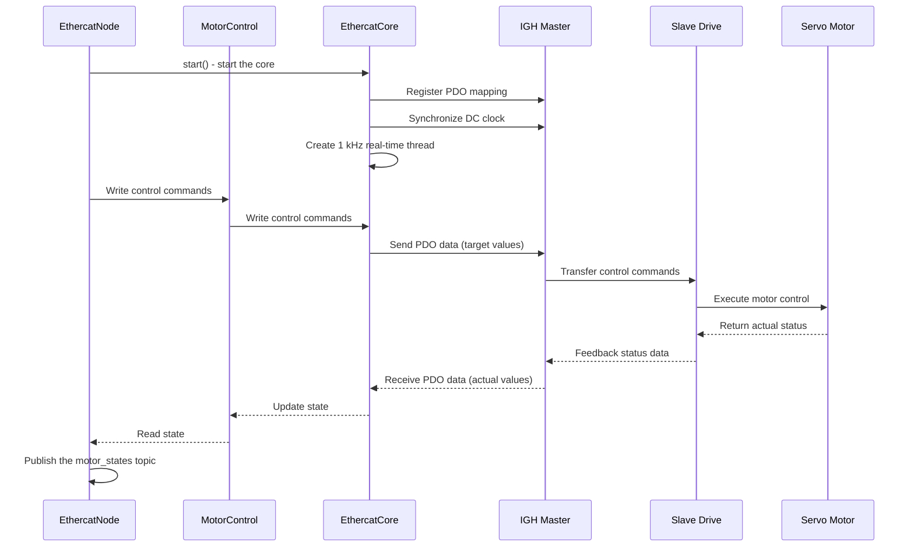
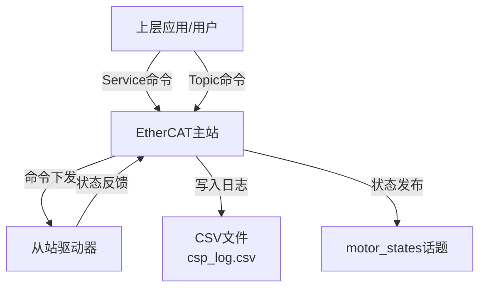

# EtherCAT 控制主站使用说明

## 📑 目录
- [EtherCAT 控制主站使用说明](#ethercat-控制主站使用说明)
  - [📑 目录](#-目录)
  - [术语表](#术语表)
  - [核心目标与程序架构](#核心目标与程序架构)
    - [核心文件架构](#核心文件架构)
    - [程序工作流程](#程序工作流程)
    - [信息流动时序图](#信息流动时序图)
    - [模块职责说明](#模块职责说明)
  - [准备与依赖](#准备与依赖)
    - [硬件依赖](#硬件依赖)
    - [硬件连接说明](#硬件连接说明)
    - [EtherCAT设备连接拓扑结构](#ethercat设备连接拓扑结构)
    - [软件依赖](#软件依赖)
  - [alias配置说明](#alias配置说明)
    - [alias介绍](#alias介绍)
    - [别名命名规则](#别名命名规则)
    - [alias配置文件参数说明](#alias配置文件参数说明)
    - [配置文件示例](#配置文件示例)
    - [电机别名修改流程](#电机别名修改流程)
    - [配置注意事项](#配置注意事项)
  - [启动流程](#启动流程)
    - [EtherCAT状态机介绍](#ethercat状态机介绍)
    - [验证命令示例](#验证命令示例)
  - [运行接口（话题与服务）](#运行接口话题与服务)
    - [数据流向简图](#数据流向简图)
    - [下发指令](#下发指令)
      - [Topic与Service比较](#topic与service比较)
      - [Topic发布方式](#topic发布方式)
      - [Service调用方式](#service调用方式)
    - [返回数据](#返回数据)
      - [状态发布](#状态发布)
      - [日志输出](#日志输出)
    - [数据流向总结](#数据流向总结)
  - [命令集与示例](#命令集与示例)
    - [基本运行控制](#基本运行控制)
    - [CSP/CSV/CST 模式](#cspcsvcst-模式)
      - [CSP/CSV/CST 模式简介](#cspcsvcst-模式简介)
      - [CSP本地速度规划说明](#csp本地速度规划说明)
      - [CSP模式日志](#csp模式日志)
    - [PVT 模式](#pvt-模式)
      - [PVT 模式完整示例](#pvt-模式完整示例)
    - [命令格式说明](#命令格式说明)
  - [示例场景和最佳实践](#示例场景和最佳实践)
    - [基本电机控制流程](#基本电机控制流程)
    - [多轴协同控制](#多轴协同控制)
    - [诊断命令](#诊断命令)
  - [错误监控节点（Error Monitor）](#错误监控节点error-monitor)
    - [节点概述](#节点概述)
    - [核心功能](#核心功能)
    - [工作原理](#工作原理)
    - [接口说明](#接口说明)
      - [话题接口](#话题接口)
      - [消息结构](#消息结构)
    - [故障代码与描述](#故障代码与描述)
    - [启动与配置](#启动与配置)
      - [启动节点](#启动节点)
      - [配置参数](#配置参数)
      - [带参数启动示例](#带参数启动示例)
    - [使用示例](#使用示例)
      - [查看实时故障信息](#查看实时故障信息)
      - [查看特定轴的故障信息](#查看特定轴的故障信息)
    - [最佳实践](#最佳实践)
  - [故障诊断与判断](#故障诊断与判断)
    - [故障检测机制](#故障检测机制)
    - [故障判断流程](#故障判断流程)
    - [常见故障类型与原因](#常见故障类型与原因)
    - [故障排除注意事项](#故障排除注意事项)
  - [故障解决方案](#故障解决方案)
    - [通信故障解决方案](#通信故障解决方案)
    - [电机故障解决方案](#电机故障解决方案)
    - [驱动器故障解决方案](#驱动器故障解决方案)
    - [配置故障解决方案](#配置故障解决方案)
    - [故障恢复流程](#故障恢复流程)
  - [安全注意事项](#安全注意事项)
    - [电气安全](#电气安全)
    - [机械安全](#机械安全)
    - [操作安全](#操作安全)
    - [软件安全](#软件安全)
    - [环境安全](#环境安全)
  - [附录](#附录)
    - [关键路径](#关键路径)
    - [PID三环参数调整](#pid三环参数调整)
      - [PID三环参数说明](#pid三环参数说明)
      - [PID参数地址表](#pid参数地址表)
      - [PID参数读取与修正指令](#pid参数读取与修正指令)
* * *

## 术语表

| 术语  | 全称  | 描述  |
| --- | --- | --- |
| CSP | Cyclic Synchronous Position | 周期同步位置模式，用于精确位置控制 |
| CSV | Cyclic Synchronous Velocity | 周期同步速度模式，用于精确速度控制 |
| CST | Cyclic Synchronous Torque | 周期同步力矩模式，用于精确力矩控制 |
| PVT | Mixed Integrated Torque | 位置/速度/力矩混合控制模式，同一帧数据包含三类闭环指令 |
| PDO | Process Data Object | 过程数据对象，用于EtherCAT主站与从站之间的实时数据交换 |
| SDO | Service Data Object | 服务数据对象，用于非实时的配置和诊断数据交换 |
| DC  | Distributed Clock | 分布式时钟，用于同步EtherCAT网络中所有从站设备的时钟 |
| AL State | Application Layer State | 应用层状态，反映EtherCAT从站的运行阶段 |
| IGH Master | IgH EtherCAT Master | EtherCAT主站程序，用于Linux系统 |
| Slave | EtherCAT Slave | 连接到EtherCAT网络的从站设备，如电机驱动器 |
| alias | 别名  | 从站设备的别名地址，用于在配置文件中标识设备，避免依赖物理地址 |
| counts | 脉冲数 | 编码器反馈的位置单位，1个counts代表编码器的一个脉冲信号 |
| status_word | 状态字 | 从站设备的状态寄存器，包含设备运行状态和故障信息 |
| error_code | 错误码 | 从站设备的错误寄存器，标识具体故障类型 |

* * *

## 核心目标与程序架构

本文面向使用RAYBOT EtherCAT 主站的客户和现场工程师，旨在从环境准备、配置管理，到话题/命令接口及诊断日志，逐步清晰地介绍完整的操作流程。

### 核心文件架构

```
/home/raybot/raybot_core_ws/install/
├── setup.bash                                # 工作区环境入口脚本
├── local_setup.bash                          # 本地环境脚本
└── ethercat_control/
    ├── lib/
    │   ├── ethercat_control/
    │   │   └── ethercat_node                # ROS2主节点可执行文件
    │   └── libethercat_core.so              # EtherCAT核心控制库（含实时控制与电机控制逻辑）
    ├── share/
    │   └── ethercat_control/
    │       ├── srv/
    │       │   └── EthercatCommand.srv      # EtherCAT命令服务定义
    │       └── package.xml                  # 功能包元信息
    └── include/
        └── ethercat_control/
            ├── ethercat_core.hpp
            └── motor_control.hpp
```

> 电机参数配置文件 `ethercat_motors.yaml` 位于：`/home/raybot/raybot_motors_config/ethercat_motors.yaml`

### 程序工作流程

### 信息流动时序图

以下是从ethercat node到ethercat core再到电机驱动的信息流动时序图，展示了控制命令的完整处理流程：



`ethercat_node` 启动后会创建一个 1 kHz 的 EtherCAT 实时控制线程，周期性向底层驱动写入控制目标并读取电机的实时状态，并通过 ROS 2 将这些数据反馈给上层应用。

### 模块职责说明

| 模块  | 主要职责 | 运行文件位置 |
| --- | --- | --- |
| ethercat_node | ROS2节点主程序，处理话题和服务接口 | /home/raybot/raybot_core_ws/install/ethercat_control/lib/ethercat_control/ethercat_node |
| motor_control | 提供电机控制函数接口和状态更新逻辑 | /home/raybot/raybot_core_ws/install/ethercat_control/lib/libethercat_core.so |
| ethercat_core | 1 kHz实时控制线程与EtherCAT周期任务 | /home/raybot/raybot_core_ws/install/ethercat_control/lib/libethercat_core.so |

## 准备与依赖

### 硬件依赖

| 项目  | 说明  |
| --- | --- |
| 硬件  | RAYBOT EtherCAT 主站 |
| 从站设备 | 支持EtherCAT协议的脉塔伺服电机 |

### 硬件连接说明

&nbsp;


- 上图中左侧1号网口为 **EtherCAT通信口**，用于直接连接电机驱动器，实现实时控制通信。
- 右侧2号网口为 **网络通信口**，用于连接到互联网或本地网络，实现远程监控和配置。

### EtherCAT设备连接拓扑结构

电机采用 **线型拓扑** 连接方式：

1.  从EtherCAT主站通信口引出网线，连接到第一台电机驱动器的 **EtherCAT IN** 端口。
2.  从第一台电机驱动器的 **EtherCAT OUT** 端口引出网线，连接到下一台电机驱动器的 **EtherCAT IN** 端口。
3.  依次类推，完成所有电机的串联连接。

**注意**：确保使用符合EtherCAT规范的网线，以保证通信质量和稳定性。

### 软件依赖

| 项目  | 说明  |scp D:\sin_test.m）\Myactuator\README.md raybot@172.16.100.8:/home/raybot/
| --- | --- |
| 系统  | Ubuntu 22.04 + 实时性系统 |
| 中间件 | ROS2 Humble |
| EtherCAT主站 | IGH EtherCAT Master |

## alias配置说明

### alias介绍

alias（别名）是EtherCAT从站设备的一个逻辑地址，用于在配置文件中唯一标识设备。使用alias的主要优势在于：

1.  **避免依赖物理地址**：设备更换或拓扑调整时无需大幅修改配置
2.  **直观的设备标识**：便于现场调试和故障排查
3.  **灵活的系统扩展**：增减设备时不必重新配置整个系统结构
4.  **统一的设备管理**：通过逻辑别名统一管理不同类型的设备

### 别名命名规则

推荐使用四位数的别名命名方式，每一位数字代表不同的含义，便于识别和管理：

| 位数  | 含义  | 示例值 | 说明  |
| --- | --- | --- | --- |
| 第一位 | 设备类型 | 1   | 表示电机设备 |
| 第二位 | 设备组号 | 1   | 表示设备所属的组号，用于区分不同功能组的设备 |
| 第三、四位 | 组内序号 | 00  | 表示设备在组内的序号 |

例如，**1100**作为别名的含义是：

- 第一个1：表示该设备是电机设备
- 第二个1：表示该设备属于第一组
- 后两位00：表示该设备是第一组中的第一个电机

这种命名方式的优势在于：

- 便于快速识别设备类型和所属组
- 支持系统扩展，可轻松添加新设备
- 提高了配置文件的可读性和可维护性
- 便于现场调试和故障排查

### alias配置文件参数说明

ethercat_node启动时，会读取alias配置文件，来识别需要使能的电机，此文件位于`/home/raybot/raybot_motors_config/ethercat_motors.yaml`，参数如下

| 参数名 | 类型  | 示例  | 含义  |
| --- | --- | --- | --- |
| name | 字符串 | motor_01 | 电机的逻辑名称，用于标识和区分不同电机 |
| alias | 整数  | 1100 | 电机的别名地址，用于在网络中唯一标识从站设备 |
| vendor_id | 十六进制字符串 | "0x00202008" | 设备供应商ID，用于识别设备制造商 |
| product_code | 十六进制字符串 | "0x00000000" | 产品代码，用于识别设备型号和版本 |
| pdo_channel | 字符串 | pvt | PDO通道类型。`pvt`适用于20250702版本固件，`standard260330`适用于260330版本固件。 |
| counts_per_rev | 整数  | 131072 | 电机每旋转一圈的编码器脉冲数，用于位置和速度计算。具体参数可从脉塔官网电机手册获得。 |
| rated_torque | 浮点数 | 50.0 | 电机额定扭矩（单位：N*m），用于力矩相关控制。具体参数可从脉塔官网电机手册获得。 |

### 配置文件示例

```yaml
# 电机配置列表，包含所有需要控制的电机
motors:
  # 第一个电机的配置
  - name: motor_01           # 电机的逻辑名称，用于标识和区分不同电机
    alias: 1100              # 电机的别名地址，用于在网络中唯一标识从站设备
    vendor_id: "0x00202008"  # 设备供应商ID，用于识别设备制造商
    product_code: "0x00000000"  # 产品代码，用于识别设备型号和版本
    pdo_channel: pvt         # 20250702版本固件使用pvt
    counts_per_rev: 131072   # 电机每旋转一圈的编码器脉冲数，具体值参考脉塔官网电机手册
    rated_torque: 50.0       # 电机额定扭矩（N*m），具体值参考脉塔官网电机手册
  # 第二个电机的配置
  - name: motor_02           # 电机的逻辑名称
    alias: 1101              # 电机的别名地址，需与第一个电机不同
    vendor_id: "0x00202008"  # 相同制造商的设备具有相同的vendor_id
    product_code: "0x00000000"  # 相同型号的设备具有相同的product_code
    pdo_channel: standard260330  # 260330版本固件使用standard260330
    counts_per_rev: 131072   # 根据电机编码器规格设置，具体值参考脉塔官网电机手册
    rated_torque: 50.0       # 电机额定扭矩（N*m），具体值参考脉塔官网电机手册
```

### 电机别名修改流程

修改电机别名需要以下步骤：

1.  **查看当前电机信息**：
    
    ```bash
    ethercat slaves
    ```
    
    该命令会显示所有连接的从站设备，包括设备的物理地址、alias和状态等信息。
    
2.  **修改电机别名**：
    
    ```bash
    ethercat alias -p <物理地址> <新alias值>
    ```
    
    其中：
    
    - `<物理地址>`：电机的物理地址，可从`ethercat slaves`命令输出中获取
    - `<新alias值>`：要设置的新别名值，例如1100、1101等
3.  **验证新alias**：
    
    ```bash
    ethercat slaves
    ```
    
    再次运行该命令，确认电机的alias已更新为新值。
    
4.  **更新配置文件**：  
    编辑`/home/raybot/raybot_motors_config/ethercat_motors.yaml`文件，将对应电机的alias字段更新为新值。
    
### 配置注意事项

- EtherCAT 主站程序仅会加载与 `alias` 配置相匹配的电机。因此，在启动主站之前，需要先编辑`/home/raybot/raybot_motors_config/ethercat_motors.yaml`配置文件，确保 `alias` 设置正确。
- `pdo_channel` 需与电机固件版本匹配：`pvt`适用于20250702版本固件，`standard260330`适用于260330版本固件。
- `counts_per_rev` 与 `rated_torque` 的具体参数可从脉塔官网电机手册获得。
- 不同电机的alias值必须唯一，避免冲突
- alias值建议使用连续的整数，便于管理和维护

## 启动流程

### EtherCAT状态机介绍

EtherCAT 从站设备遵循一套严格定义的状态机，用于描述设备从上电初始化到进入正常运行（OP）整个生命周期的各个阶段。了解这些状态有助于监控和诊断EtherCAT系统：

| 状态缩写 | 状态名称 | 描述  |
| --- | --- | --- |
| INIT | Initialization | 设备初始化状态，刚上电或复位后的初始状态 |
| PREOP | Pre-Operational | 预操作状态，设备已完成初始化，可配置参数但无法进行实时通信 |
| SAFEOP | Safe Operational | 安全操作状态，PDO通信已配置但不执行控制命令，用于安全验证 |
| OP  | Operational | 操作状态，设备正常运行，实时PDO通信激活，可执行控制命令 |

电机只有进入**OP状态**才能正常接收和执行控制命令。启动流程的目标就是将电机从INIT状态逐步引导到OP状态。

**启动EtherCAT控制主站程序**

1.  加载环境 `source /home/raybot/raybot_core_ws/install/setup.bash`
    
2.  运行节点：
    
    ```bash
    ros2 run ethercat_control ethercat_node \
      --ros-args \
      -p csv_path:="/home/raybot/raybot_logs/csp_log/csp_log_custom.csv" \
      -p joint_state_pub_hz:=200
    # 命令解释：
    # ros2 run：ROS2的命令，用于运行指定功能包中的节点
    # ethercat_control：功能包名称，包含ethercat_node节点
    # ethercat_node：要运行的节点名称
    # --ros-args：传递参数给ROS2节点的选项
    # -p csv_path:="/home/raybot/raybot_logs/csp_log/csp_log_custom.csv"：设置CSV日志文件的保存路径
    # -p joint_state_pub_hz:=200：设置motor_states话题的发布频率为200Hz
    ```
    
3.  启动后会打印 `ethercat_node ready.`，电机将依次从PREOP进入OP状态。
    

### 验证命令示例

```bash
# 查看 EtherCAT 主站状态
ethercat master 
# 查看 EtherCAT 从站状态 
ethercat slaves
```

运行`ethercat slaves`指令，查看电机是否进入OP状态（"OP"显示在从站状态列中）

预期输出示例（电机成功进入 OP 状态）：

| 序号 | 从站地址 | 状态 | 链路 | 设备类型 |
| --- | --- | --- | --- | --- |
| 0 | 1100:0 | OP | + | MT_Device |
| 1 | 1101:0 | OP | + | MT_Device |
| 2 | 1102:0 | OP | + | MT_Device |


## 运行接口（话题与服务）

### 数据流向简图



该数据流向图展示了EtherCAT控制主站的核心数据交互过程：

1.  上层应用或用户可以通过两种方式向EtherCAT主站发送命令：
    - Service调用：用于同步执行命令并获取结果。
    - Topic发布：用于高频、异步的控制命令。
2.  EtherCAT主站将命令下发到从站驱动器。
3.  从站驱动器执行命令并将状态反馈给主站。
4.  主站将电机运行状态信息写入CSV日志文件，默认路径为`/home/raybot/raybot_logs/csp_log/csp_log_YYYYMMDD_HH_MM.csv`。
5.  主站定期发布motor_states话题，包含各轴的实际位置、速度和力矩信息。

### 下发指令

EtherCAT主站支持两种方式接收上层应用的命令，分别是Topic发布和Service调用。

#### Topic与Service比较

下表详细比较了两种方式的特点：

| 特性  | Topic发布 | Service调用 |
| --- | --- | --- |
| **通信模式** | 异步发布/订阅 | 同步请求/响应 |
| **延迟** | 低，适合高频控制 | 相对较高，包含请求-响应往返时间 |
| **执行方式** | 单向通信，不等待执行结果 | 双向通信，等待命令执行完成并返回结果 |
| **结果反馈** | 无直接反馈，需通过状态话题获取 | 有详细的执行结果，包括成功状态、处理数量和错误信息 |
| **批量执行** | 支持，可在单条消息中包含多条命令 | 支持，一次性发送多条命令，减少网络开销 |
| **脚本友好性** | 适合持续控制，不适合需要确认结果的脚本 | 适合脚本自动化，便于获取执行结果和错误处理 |
| **可靠性** | 依赖于ROS2的QoS设置，可能丢失消息 | 有确认机制，确保命令被处理 |
| **资源占用** | 较低，适合高频发布 | 较高，每次调用需要建立连接 |
| **适用频率** | 高频率（如1kHz控制命令） | 低频率（如配置、初始化命令） |

**指令方式选择建议**：

按照使用频率和重要性排序，推荐的指令方式选择如下：

| 场景  | 建议使用 | 原因  |
| --- | --- | --- |
| 实时控制（如位置/速度/力矩指令） | Topic | 更低的延迟，适合高频控制命令，是最常用的控制方式 |
| 状态查询（如实时位置/速度监控） | Topic | 持续获取状态信息，适合监控场景，是常用的监控方式 |
| 初始化配置（如设置运行模式、参数） | Service | 可以确认配置是否成功，是系统启动时的必要操作 |
| 批量命令执行（如多轴同步配置） | Service | 减少网络通信次数，提高效率，适合多轴协同控制 |
| 零点校准、参数保存等操作 | Service | 需要确认操作是否成功完成，是定期维护的重要操作 |
| 紧急停止命令 | Service | 确保停止命令被执行并返回结果，是安全相关的关键操作 |
| 脚本自动化（如测试脚本、自动化流程） | Service | 便于获取执行结果，进行错误处理，适合自动化测试和流程 |

#### Topic发布方式

**核心文本命令入口**，用于高频、异步的控制命令。

| 话题名称 | 消息类型 | 描述  |
| --- | --- | --- |
| /ethercat/set | std_msgs/msg/String | 核心文本命令入口，格式为 axis command value |

**话题示例**：

```
ros2 topic pub --once /ethercat/set std_msgs/msg/String "data: '1100 pos 10000; 1101 vel 2000; 1102 tor 300'"
# 解释：同时向三个电机发送不同类型的命令
# 1100 pos 10000：向alias为1100的电机发送CSP模式位置命令，目标位置为10000 counts
# 1101 vel 2000：向alias为1101的电机发送CSV模式速度命令，目标速度为2000 counts/s
# 1102 tor 300：向alias为1102的电机发送CST模式力矩命令，目标力矩为300（额定力矩的30%）
```

#### Service调用方式

用于同步执行命令并获取结果，适用于需要确保命令执行状态的场景。

| 服务名称 | 服务类型 | 描述  |
| --- | --- | --- |
| /ethercat/command | ethercat_control/srv/EthercatCommand | 用于脚本或控制器同步下发命令，可一次填写整串命令并在响应中读取执行结果 |

**服务定义**：

**请求字段**

| 字段名 | 类型  | 描述  |
| --- | --- | --- |
| command | string | 要执行的命令字符串 |

**响应字段**

| 字段名 | 类型  | 描述  |
| --- | --- | --- |
| success | bool | 命令执行是否成功（所有命令都成功执行则为 true） |
| processed | uint32 | 处理的命令数量 |
| failed | uint32 | 失败的命令数量 |
| message | string | 执行结果消息，包含详细的执行状态和错误信息 |

**服务调用示例**：
```bash
ros2 service call /ethercat/command ethercat_control/srv/EthercatCommand "{command: '1100 csp_mode planner; 1100 csp_vel_limit 200'}"

ros2 service call /ethercat/command ethercat_control/srv/EthercatCommand "{command: '1100 position 20000; 1101 velocity 1200; 1102 torque 50'}"
```
### 返回数据

EtherCAT主站通过两种方式向外部提供数据反馈：状态发布和日志输出。

#### 状态发布

定期发布电机状态信息，用于实时监控电机运行情况。

| 话题名称 | 查看命令  | 描述  |
| --- | --- | --- |
| /motor_states | ros2 topic echo /motor_states | 实际位置/速度/力矩状态，可配置发布频率（默认频率为10 Hz） |
| /motor_states_alias | ros2 topic echo /motor_states_alias | 按 alias 命名发布状态，位置/速度为弧度制 |
| /motor_op_state | ros2 topic echo /motor_op_state | 各轴AL状态（INIT/PREOP/SAFEOP/OP） |
| /motor_mode_state | ros2 topic echo /motor_mode_state | 各轴运行模式（PVT/HOMING/CSP/CSV/CST/UNKNOWN） |
| /motor_temperature_states | ros2 topic echo /motor_temperature_states | 各轴电机温度原始值（0x2009） |
| /csp_table | ros2 topic echo /csp_table | 与CSV同结构的一行文本数据 |

**状态查看示例**：

```
ros2 topic echo /motor_states

```

**读取电机运行模式（CSV/CSP/CST 等）指令：**

```bash
# 连续查看各轴当前模式（mode_name 字段会显示 CSP/CSV/CST 等）
ros2 topic echo /motor_mode_state

# 只读取一帧
ros2 topic echo --once /motor_mode_state
```

```bash
# 按 alias 直接读取单轴模式显示值（对象 0x6061）
ethercat upload -a 1100 -t int8 0x6061 0
```

模式码对照：

| 模式码 | 模式名 |
| --- | --- |
| 5 | PVT |
| 6 | HOMING |
| 8 | CSP |
| 9 | CSV |
| 10 | CST |

**读取电机温度指令：**

```bash
# 连续查看各轴温度原始值（0x2009）
ros2 topic echo /motor_temperature_states

# 只读取一帧
ros2 topic echo --once /motor_temperature_states
```

```bash
# 按 alias 直接读取单轴温度原始值（对象 0x2009）
ethercat upload -a 1100 -t uint16 0x2009 0
```

说明：

- `/motor_temperature_states` 发布的是温度原始值数组（`name` 与 `temp_raw` 一一对应）。
- 仅当该轴的 PDO profile 包含温度对象（0x2009）时可读到有效值；未包含时该轴温度值为 `0`。

#### 日志输出

将电机控制数据和状态信息记录到CSV文件，便于后续分析和调试。

| 日志类型 | 默认路径 | 描述  |
| --- | --- | --- |
| CSP日志 | /home/raybot/raybot_logs/csp_log/csp_log_YYYYMMDD_HH_MM.csv | 启动即写入，记录目标/反馈/误差与斜率数据 |

### 数据流向总结

1.  **指令下发**：上层应用通过Topic或Service向EtherCAT主站发送控制命令。
2.  **命令执行**：EtherCAT主站将命令下发到从站驱动器，从站执行命令并反馈状态。
3.  **数据返回**：EtherCAT主站将状态信息通过Topic发布，并将控制数据写入日志文件。

这种信息流动模式实现了上层应用与底层硬件之间的双向通信，既可以发送控制指令，又可以获取实时状态和历史日志。

## 命令集与示例

### 基本运行控制

| 命令  | 描述  | 示例  |
| --- | --- | --- |
| stop | 电机停止运动 | ros2 topic pub --once /ethercat/set std_msgs/msg/String "data: '1100 stop'" |
| save | 执行PID、零点参数保存 | ros2 topic pub --once /ethercat/set std_msgs/msg/String "data: '1100 save'" |
| zero | 执行零点校准 | ros2 topic pub --once /ethercat/set std_msgs/msg/String "data: '1100 zero'" |

### CSP/CSV/CST 模式

#### CSP/CSV/CST 模式简介

CSP、CSV、CST是EtherCAT系统中常用的三种周期同步控制模式，它们各有特点，适用于不同的应用场景：

| 模式缩写 | 模式名称 | 特点  | 适用场景 |
| --- | --- | --- | --- |
| **CSP** | Cyclic Synchronous Position | 周期同步位置模式，主站周期性发送目标位置，从站实时跟踪 | 高精度位置控制场景，如机器人手臂、精密加工设备 |
| **CSV** | Cyclic Synchronous Velocity | 周期同步速度模式，主站周期性发送目标速度，从站实时跟踪 | 恒速运行场景，如传送带、风机控制 |
| **CST** | Cyclic Synchronous Torque | 周期同步力矩模式，主站周期性发送目标力矩，从站实时跟踪 | 恒力矩控制场景，如张力控制、压力控制 |

这三种模式的共同特点是：

- 基于EtherCAT实时通信，控制周期可达1kHz甚至更高
- 主站与从站之间保持严格的时间同步
- 支持多轴协同控制
- 具有较高的控制精度和动态响应

选择合适的控制模式取决于具体的应用需求，例如：

- 需要精确位置控制时选择CSP模式
- 需要稳定速度控制时选择CSV模式
- 需要精确力/力矩控制时选择CST模式

#### CSP本地速度规划说明

**CSP本地速度规划**是指在 EtherCAT **主站侧**（本地）对 CSP（周期同步位置）模式下的运动过程进行速度/加速度约束与轨迹生成，而不是仅将“目标位置”直接下发给从站伺服驱动器并让其自行以最快方式到位。

当启用 `csp_plan` 命令后，主站会依据用户配置的运动约束参数，例如最大速度 `csp_vmax` 与加速度 `csp_acc`，对目标位置进行**平滑轨迹规划**。主站会生成满足速度与加速度限制的**连续位置序列**（位置轨迹点），并在每个固定控制周期（1K Hz 实时循环）将下一时刻的规划位置点发送给从站。这样从站在 CSP 模式下只需跟随主站给出的轨迹点即可，实现运动过程更平稳、冲击更小、可重复性更好。

当关闭 `csp_plan` 命令后，主站不再进行本地轨迹生成，而是直接下发目标位置：从站接收到新的目标位置后，电机会以**尽可能快的速度**进行位置跟踪和到位。<span style="color: rgb(224, 62, 45);">警告</span>：如果目标位置距离实际位置过远，电机会出现冲击、振动或跟随误差增大等现象。

**CSP本地速度规划**的优势是：

1.  实现平滑的加减速控制，减少机械冲击。
2.  降低对网络通信带宽的要求，因为主站只需要发送最终规划好的位置点。
3.  提高系统的稳定性和可靠性，避免因网络延迟导致的轨迹偏差。

下图为CSP本地梯形速度规划示意图：


| 命令  | 模式  | 描述  | 单位  | 示例  |
| --- | --- | --- | --- | --- |
| csp_plan | CSP | 启用 CSP 本地规划模式 | \-  | ros2 topic pub --once /ethercat/set std_msgs/msg/String "data: '1100 csp_plan on'" |
| csp_vmax | CSP | 设置 CSP 本地规划模式最大速度 | counts/s | ros2 topic pub --once /ethercat/set std_msgs/msg/String "data: '1100 csp_vmax 50000'" |
| csp_acc | CSP | 设置 CSP本地规划模式加速度 | counts/s² | ros2 topic pub --once /ethercat/set std_msgs/msg/String "data: '1100 csp_acc 200000'" |
| pos | CSP | CSP 目标位置 | counts | ros2 topic pub --once /ethercat/set std_msgs/msg/String "data: '1100 pos 10000'" |
| vel | CSV | CSV 目标速度 | counts/s | ros2 topic pub --once /ethercat/set std_msgs/msg/String "data: '1101 vel 1200'" |
| tor | CST | CST 目标力矩 | 额定力矩的千分之一 | ros2 topic pub --once /ethercat/set std_msgs/msg/String "data: '1100 tor 100'" |

**多电机同步控制示例**

```
ros2 topic pub --once /ethercat/set std_msgs/msg/String "data: '1100 pos 10000; 1101 vel 1200; 1100 tor 100'"

```

#### CSP模式日志

CSP（Cyclic Synchronous Position）模式日志用于记录电机在周期同步位置模式下的运行数据，通过分析这些日志可以直观查看电机的响应情况，包括位置跟踪精度、响应速度和控制稳定性等关键性能指标。

**日志格式**

**CSV 日志格式**：按轴横向并排，单轴列为  
`Time(s),Alias,Tor_Raw,Tor_Pct(%),Vel_Raw,Vel(deg/s),Pos_Raw,Pos(deg),Cmd_Pos_Raw,Cmd_Pos_Deg,Pos_Error(deg),Pos_Error(Raw),Tor_K,Err_K`；  
表头先写入并同步推送到 `csp_table`。

**日志字段物理含义**

| 字段名 | 单位  | 物理含义 |
| --- | --- | --- |
| Time(s) | s  | 日志记录的时间戳，从节点启动开始计时 |
| Alias | \-  | 电机alias |
| Pos_Raw / Cmd_Pos_Raw / Pos_Error(Raw) | counts | 位置反馈/目标/误差原始值 |
| Pos(deg) / Cmd_Pos_Deg / Pos_Error(deg) | deg | 位置反馈/目标/误差角度值 |
| Vel_Raw / Vel(deg/s) | counts/s, deg/s | 速度原始值与角速度 |
| Tor_Raw / Tor_Pct(%) | 原始值, % | 力矩原始值与百分比显示值 |
| Tor_K / Err_K | raw/s | 力矩与位置误差变化斜率 |

**电机响应分析**

通过CSP模式日志可以分析以下电机响应情况：

1.  **位置跟踪精度**：通过比较`Cmd_Pos_Raw`与`Pos_Raw`（或对应deg字段）评估跟踪能力。
2.  **响应速度**：观察实际位置从当前值到目标值的变化过程，分析电机的动态响应特性。
3.  **控制稳定性**：通过`Pos_Error(Raw)`/`Pos_Error(deg)`的变化趋势判断是否存在振荡或超调。
4.  **多轴同步性**：对比不同轴的命令值和实际值变化，评估多轴协同工作的同步性能。

### PVT 模式

**功能说明**：PVT 模式（又称 MIT 模式）为一种混合控制模式，在同一帧数据里包含 **位置、速度、力矩**三类的闭环指令。在 PVT 控制模式中，电机输出电流参考值由**位置误差的比例项**、**速度误差的微分项**以及**力矩前馈项**共同构成，并通过输出侧力矩系数换算为q轴电流指令：


| 变量  | 含义  | 单位  |
| --- | --- | --- |
| p_des | 期望位置 | rad |
| v_des | 期望速度 | rad/s |
| tau_ff | 前馈力矩 | Nm  |
| p_fb | 实际位置 | rad |
| v_fb | 实际速度 | rad/s |
| kp  | 位置增益 | Nm/rad |
| kd  | 速度增益 | Nm/(rad/s) |
| Iq_ref | q轴电流 | A   |
| KT_out | 力矩系数 | Nm/A |

&nbsp;

PVT模式控制命令如下：

| 命令  | 描述  | 示例  |
| --- | --- | --- |
| pvt | 切换到 PVT 模式 | ros2 topic pub --once /ethercat/set std_msgs/msg/String "data: '1100 pvt'" |
| kp  | 设置比例增益 | ros2 topic pub --once /ethercat/set std_msgs/msg/String "data: '1100 kp 10'" |
| kd  | 设置微分增益 | ros2 topic pub --once /ethercat/set std_msgs/msg/String "data: '1100 kd 2'" |
| pvtpos | PVT 目标位置 （单位：counts） | ros2 topic pub --once /ethercat/set std_msgs/msg/String "data: '1100 pvtpos 20000'" |
| pvtvel | PVT 目标速度 （单位：counts/s） | ros2 topic pub --once /ethercat/set std_msgs/msg/String "data: '1100 pvtvel 3000'" |
| pvttor | PVT 目标力矩 （单位：额定力矩的千分之一） | ros2 topic pub --once /ethercat/set std_msgs/msg/String "data: '1100 pvttor 0'" |

#### PVT 模式完整示例

```
ros2 topic pub --once /ethercat/set std_msgs/msg/String  
"data: '1100 pvt; 1100 kp 10; 1100 kd 2; 1100 pvtpos 20000; 1100 pvtvel 3000; 1100 pvttor 0'"

```

### 命令格式说明

- **axis 标识符**：支持轴索引和alias（如 `0` 或 `1100`）；错误索引或 alias 会在日志中警告 `bad axis`。
- **命令分隔**：可用 `;` 分号同时下发多条命令，例如 `1100 stop; 1101 pos 2000; 1102 kp 8`。

## 示例场景和最佳实践

### 基本电机控制流程

**场景描述**：单轴电机启动、运行和停止。

```bash
# 1. 启动 EtherCAT 节点
ros2 run ethercat_control ethercat_node --ros-args -p csv_path:="/home/raybot/raybot_logs/csp_log/csp_log_custom.csv"

# 2. 设置 CSP 模式参数
ros2 topic pub --once /ethercat/set std_msgs/msg/String "data: '1100 csp_vmax 50000; 1100 csp_acc 200000'"

# 3. 发送位置命令（目标位置 10000 counts）
ros2 topic pub --once /ethercat/set std_msgs/msg/String "data: '1100 pos 10000'"

# 4. 监控运行状态
ros2 topic echo /motor_states
ros2 topic echo /motor_mode_state

# 5. 停止电机
ros2 topic pub --once /ethercat/set std_msgs/msg/String "data: '1100 stop'"
```

### 多轴协同控制

**场景描述**：多轴同步运动。

```bash
# 多轴同时发送位置命令
ros2 topic pub --once /ethercat/set std_msgs/msg/String "data: '1100 pos 5000; 1101 pos 8000; 1102 pos 3000; 1103 pos 10000'"

# 多轴同时停止
ros2 topic pub --once /ethercat/set std_msgs/msg/String "data: '1100 stop; 1101 stop; 1102 stop; 1103 stop'"
```

### 诊断命令

| 命令  | 描述  | 适用场景 |
| --- | --- | --- |
| ethercat master | 查看 EtherCAT 主站状态 | 检查主站是否正在运行 |
| ethercat slaves | 查看从站设备信息 | 确认从站设备是否被正确识别 |
| ros2 node list | 查看运行中的 ROS2 节点 | 确认 ethercat_node 是否正常启动 |
| ros2 topic list | 查看发布的话题 | 确认话题是否正常发布 |
| dmesg -T \| grep ethercat | 查看内核日志中的 EtherCAT 相关信息 | 排查硬件或驱动问题 |

## 错误监控节点（Error Monitor）

### 节点概述

错误监控节点是EtherCAT系统的重要组件，专门用于**周期性监测和报告电机故障情况**。当前版本中该节点由`ethercat_node`进程内自动创建，不需要单独启动。节点通过读取主站实时状态快照（`mc_get_state`、`mc_get_al_state`、`mc_get_online_state`）发布标准ROS 2消息。

### 核心功能

| 功能  | 描述  |
| --- | --- |
| 周期性故障监测 | 按照配置的周期，从EtherCAT总线读取各轴状态字和错误码 |
| 故障自动解码 | 将原始错误码转换为易读的故障描述信息 |
| 故障状态发布 | 通过ROS 2话题发布电机故障状态数组 |
| 轴状态追踪 | 追踪各轴AL状态与在线状态 |
| 轴数量限制 | 支持通过参数限制发布前N个轴 |

### 工作原理

1.  **初始化配置**：读取节点参数，初始化轴配置和状态变量。
2.  **周期性读取**：
    - 对每个轴读取主站共享状态快照（`status_word`、`error_code`、`al_state`、在线状态）。
3.  **故障判断**：
    - 检查状态字中的故障位是否激活。
    - 检查错误码是否非零。
4.  **错误解码**：使用内置的故障解码器将错误码转换为易读的故障描述。
5.  **消息发布**：将所有轴的故障信以Topic形式发布。
6.  **状态更新**：更新各轴的状态追踪信息。

### 接口说明

#### 话题接口

| 话题名称 | 描述  |
| --- | --- |
| /motor_errors | 周期性发布所有轴的故障状态信息，包含每个轴的详细故障数据 |

#### 消息结构

`MotorError`消息包含以下字段：

| 字段名 | 类型  | 描述  |
| --- | --- | --- |
| axis_id | int32 | 轴索引 |
| alias | int32 | 电机别名 |
| motor_name | string | 电机名称（当前版本预留字段，默认空字符串） |
| state | string | 电机状态描述 |
| status_word | uint16 | 电机状态字 |
| error_code | uint16 | 电机错误码 |
| al_state | uint8 | 应用层状态 |
| operation_enabled | bool | 是否处于operation enabled状态 |
| fault_active | bool | 是否存在活动故障 |
| fault_messages | string\[\] | 解码后的故障描述信息 |

### 故障代码与描述

错误监控节点（Error Monitor）支持的电机故障代码及其描述如下：

| 故障代码 | 故障描述 |
| --- | --- |
| 0x0002 | 电机堵转 |
| 0x0004 | 低压  |
| 0x0008 | 过压  |
| 0x0010 | 相电流过流 |
| 0x0040 | 功率超限 |
| 0x0080 | 标定参数写入错误 |
| 0x0100 | 超速  |
| 0x0800 | 元器件过温 |
| 0x1000 | 电机温度过温 |
| 0x2000 | 编码器校准错误 |
| 0x4000 | 编码器数据错误 |

### 启动与配置

#### 启动节点

错误监控节点（Error Monitor）由`ethercat_node`自动创建并运行，无需单独启动。

可通过以下命令确认节点已启动：

```bash
ros2 node list | grep motor_error_monitor
```

#### 配置参数

| 参数名称 | 类型  | 默认值 | 描述  |
| --- | --- | --- | --- |
| publish_period_ms | double | 1000.0 | 消息发布周期（毫秒） |
| axis_count | int | -1 | 限制发布的轴数量（-1表示全部） |
| output_topic | string | motor_errors | 故障发布话题名 |
| frame_id | string | motor_errors | 消息头frame_id |

#### 带参数启动示例

```bash
ros2 run ethercat_control ethercat_node \
  --ros-args \
  -p motor_error_monitor.publish_period_ms:=500 \
  -p motor_error_monitor.axis_count:=6
```

### 使用示例

#### 查看实时故障信息

查看错误信息

```bash
ros2 topic echo /motor_errors
```

#### 查看特定轴的故障信息

```bash
ros2 topic echo /motor_errors | grep -A 10 "axis_id: 0"
```

### 最佳实践

1.  **合理配置轴数量**：根据实际系统中的电机数量配置`axis_count`参数，避免不必要的资源消耗。
2.  **结合诊断命令**：将错误监控节点（Error Monitor）的故障信息与`ethercat slaves`等诊断命令结合使用，有助于快速定位问题。
3.  **按需调整发布周期**：在调试阶段可提高发布频率，稳定运行后建议使用默认周期降低系统开销。

## 故障诊断与判断

### 故障检测机制

EtherCAT系统通过多种机制实现故障检测，确保系统的可靠性和安全性：

| 检测机制 | 描述  | 实现方式 |
| --- | --- | --- |
| **诊断命令** | 获取系统整体状态，定位故障范围 | 使用`ethercat master`、`ethercat slaves`等命令 |
| **错误监控节点（Error Monitor）** | 实时监测和报告各轴故障，提供标准化故障信息 | 启动`ethercat_node`后自动运行，订阅`/motor_errors` 话题 |

### 故障判断流程

当EtherCAT系统出现故障时，建议按照以下流程进行故障判断和定位：

1.  **初步检查**：

- 检查系统电源是否正常
- 检查EtherCAT网线连接是否松动

2.  **系统状态诊断**：

```bash
# 查看EtherCAT主站状态
ethercat master

# 查看所有从站设备状态
ethercat slaves
```

检查从站设备是否都处于OP状态，若有设备处于其他状态，说明该设备存在问题。

3.  **故障信息获取**：

```bash
# 查看错误监控节点（Error Monitor）发布的故障信息
ros2 topic echo /motor_errors

```

获取详细的故障码和故障描述。

6.  **故障码解析**：  
    根据错误监控节点（Error Monitor）提供的故障码，对照故障码表（详见8.5节）解析具体故障原因。
    
7.  **现场验证**：
    

- 检查机械部件是否卡死
- 测量电源电压是否在正常范围内
- 检查电机编码器连接是否正常
- 验证配置文件是否正确

### 常见故障类型与原因

EtherCAT系统常见的故障类型及其可能原因如下：

| 故障类型 | 典型表现 | 可能原因 |
| --- | --- | --- |
| **通信故障** | 从站无法被识别、通信中断、AL状态异常 | 网线连接松动、拓扑错误、从站电源故障、主站配置错误 |
| **电机故障** | 电机无法启动、运行异常、噪音过大、发热严重 | 电机堵转、过载、编码器故障、机械卡死、轴承损坏 |
| **驱动器故障** | 驱动器报警、错误码非零、状态字异常 | 过压/欠压、过流、过热 |
| **配置故障** | 主站无法加载配置、参数错误、alias不匹配 | 配置文件格式错误、alias重复、缺少必要参数、参数值超出范围 |
| **同步故障** | 多轴不同步、位置偏差过大、速度波动 | DC同步失败、网络延迟过大、负载不均衡 |

### 故障排除注意事项

1.  **安全第一**：在进行故障排除前，务必断开系统电源，避免触电或机械伤害。
2.  **系统性排查**：按照从整体到局部、从简单到复杂的原则进行排查，避免盲目操作。
3.  **记录故障信息**：详细记录故障发生时的现象、错误码、系统状态等信息，便于后续分析。
4.  **参考设备手册**：遇到复杂故障时，参考电机驱动器和EtherCAT主站的设备手册。
5.  **备份配置文件**：在修改配置文件前，先备份原有文件，避免配置错误导致系统无法启动。
6.  **逐步验证**：每排除一个可能的故障原因后，进行一次系统测试，确认故障是否已解决。

## 故障解决方案

### 通信故障解决方案

| 故障现象 | 可能原因 | 解决方案 |
| --- | --- | --- |
| 从站无法被识别 | 网线连接松动 | 检查并重新连接网线，确保接触良好 |
|     | alias配置错误 | 检查配置文件中的alias设置，确保与实际设备一致 |
|     | 从站电源故障 | 检查从站设备电源，确保供电正常 |
|     | 拓扑结构错误 | 确认电机串联连接顺序正确 |
| 通信中断 | 网络干扰 | 使用屏蔽网线，远离强电设备 |
|     | 从站设备故障 | 替换故障从站设备，重新配置 |
|     | 主站网口故障 | 尝试重启主站，如问题持续，联系技术支持 |

### 电机故障解决方案

| 故障现象 | 可能原因 | 解决方案 |
| --- | --- | --- |
| 电机无法启动 | 电机堵转（错误码：0x0002） | 检查负载是否过重，清除障碍物，重新启动 |
|     | 编码器校准错误（错误码：0x2000） | 重新执行编码器校准，确保校准过程中电机无干扰 |
|     | 电机温度过温（错误码：0x1000） | 停止运行，等待电机冷却，检查散热条件 |
| 电机运行不稳定 | 编码器数据错误（错误码：0x4000） | 检查编码器接线，确保信号传输正常，如问题持续，更换编码器 |
|     | PID参数设置不当 | 重新调整PID参数，从小值开始逐步优化 |

### 驱动器故障解决方案

| 故障现象 | 可能原因 | 解决方案 |
| --- | --- | --- |
| 过压报警 | 电源电压过高 | 检查输入电源电压，确保在驱动器额定范围内 |
| 低压报警 | 电源电压过低 | 检查输入电源电压，确保稳定供电 |
| 过流报警 | 电机短路/负载过大 | 检查电机绕组，排除短路故障/减小负载，或更换更大功率的驱动器 |
| 过热报警 | 环境温度过高/负载持续过高 | 优化负载，或增加散热措施 |

### 配置故障解决方案

| 故障现象 | 可能原因 | 解决方案 |
| --- | --- | --- |
| 主站无法加载alias配置 | 配置文件格式错误 | 检查YAML配置文件格式，确保语法正确 |
| 参数设置错误 | PID参数过大 | 重新调整PID参数，从小值开始逐步优化 |

### 故障恢复流程

1.  **故障确认**：确认故障类型和具体原因。
2.  **故障排除**：根据故障解决方案采取相应措施。
3.  **故障复位**：重新上电设备以重置故障。
4.  **测试验证**：在安全条件下进行测试，确保故障已排除。
5.  **参数保存**：如果修改了PID等参数，务必保存，避免断电丢失。
6.  **记录归档**：记录故障原因、解决方案和处理结果，便于后续分析。

## 安全注意事项

### 电气安全

1.  **断电操作**：在进行接线、维护或故障处理时，务必先断开电源。
2.  **静电防护**：接触电子设备前，先释放人体静电。
3.  **接地可靠**：确保系统良好接地，防止触电和电磁干扰。
4.  **电压范围**：确保输入电压在设备额定范围内，避免过压损坏。
5.  **线缆检查**：定期检查线缆是否老化、破损，及时更换。

### 机械安全

1.  **运动区域防护**：在电机运行时，确保运动区域内无人或障碍物。
2.  **负载检查**：确保负载符合电机和驱动器的额定能力。
3.  **紧急停止**：熟悉紧急停止操作流程，确保在紧急情况下能快速停止系统。
4.  **机械共振**：避免系统在共振频率下运行，防止机械损坏。
5.  **定期维护**：定期检查机械部件，如轴承、联轴器等，确保运行正常。

### 操作安全

1.  **培训上岗**：操作人员必须经过专业培训，熟悉系统操作流程。
2.  **操作规范**：严格按照操作手册进行操作，避免误操作。
3.  **状态检查**：在启动系统前，检查各设备状态，确保正常。
4.  **监控运行**：系统运行时，密切监控运行状态，及时发现异常。
5.  **故障处理**：遇到故障时，按照故障处理流程进行，避免盲目操作。

### 软件安全

1.  **配置备份**：定期备份配置文件和参数，避免数据丢失。
2.  **日志管理**：定期检查和分析日志，及时发现潜在问题。

### 环境安全

1.  **温度控制**：确保设备运行环境温度在规定范围内。
2.  **湿度控制**：避免在潮湿环境下运行，防止设备锈蚀。
3.  **防尘措施**：采取适当的防尘措施，保护设备内部清洁。
4.  **通风良好**：确保设备通风良好，避免过热。
5.  **远离干扰源**：远离强电设备和电磁干扰源。

## 附录

### 关键路径

| 资源类型 | 路径  | 描述  |
| --- | --- | --- |
| 功能包 | /home/raybot/raybot_core_ws/install/ethercat_control | 主功能包运行目录 |
| 配置文件 | /home/raybot/raybot_motors_config/ethercat_motors.yaml | 电机配置文件 |
| 服务定义 | /home/raybot/raybot_core_ws/install/ethercat_control/share/ethercat_control/srv/EthercatCommand.srv | EtherCAT 命令服务定义 |
| 日志文件 | /home/raybot/raybot_logs/csp_log/csp_log_YYYYMMDD_HH_MM.csv | CSV 日志文件，可通过参数定制路径 |

### PID三环参数调整

#### PID三环参数说明

PID三环控制是指电流环、速度环和位置环的嵌套控制，各环参数说明如下：

| 环类型 | 参数类型 | 说明  |
| --- | --- | --- |
| 电流环 | KP (比例增益) | 电流环比例系数，影响电流响应速度 |
| 电流环 | KI (积分增益) | 电流环积分系数，消除静态误差 |
| 速度环 | KP (比例增益) | 速度环比例系数，影响速度响应速度 |
| 速度环 | KI (积分增益) | 速度环积分系数，消除速度静态误差 |
| 位置环 | KP (比例增益) | 位置环比例系数，影响位置响应速度 |
| 位置环 | KI (积分增益) | 位置环积分系数，消除位置静态误差 |
| 位置环 | KD (微分增益) | 位置环微分系数，抑制超调，提高稳定性 |

#### PID参数地址表

下表给出每个 PID 参数的地址、读取指令与写入指令（将 `<alias>` 替换为目标电机别名，将 `<new_value>` 替换为目标值）：

| 环类型 | 参数名称 | 地址  | 读取指令 | 写入指令 |
| --- | --- | --- | --- | --- |
| 电流环 | CUR_LOOP_KP | 0x2002 | `ethercat upload -a <alias> -t float 0x2002 0` | `ethercat download -a <alias> -t float 0x2002 0 <new_value>` |
| 电流环 | CUR_LOOP_KI | 0x2003 | `ethercat upload -a <alias> -t float 0x2003 0` | `ethercat download -a <alias> -t float 0x2003 0 <new_value>` |
| 速度环 | SPD_LOOP_KP | 0x2004 | `ethercat upload -a <alias> -t float 0x2004 0` | `ethercat download -a <alias> -t float 0x2004 0 <new_value>` |
| 速度环 | SPD_LOOP_KI | 0x2005 | `ethercat upload -a <alias> -t float 0x2005 0` | `ethercat download -a <alias> -t float 0x2005 0 <new_value>` |
| 位置环 | POS_LOOP_KP | 0x2006 | `ethercat upload -a <alias> -t float 0x2006 0` | `ethercat download -a <alias> -t float 0x2006 0 <new_value>` |
| 位置环 | POS_LOOP_KI | 0x2007 | `ethercat upload -a <alias> -t float 0x2007 0` | `ethercat download -a <alias> -t float 0x2007 0 <new_value>` |
| 位置环 | POS_LOOP_KD | 0x2008 | `ethercat upload -a <alias> -t float 0x2008 0` | `ethercat download -a <alias> -t float 0x2008 0 <new_value>` |

#### PID参数读取与修正指令

按上表选择参数后，推荐执行顺序为：先读取当前值，再写入目标值，最后再次读取确认写入结果。

**注意事项：**

1.  修改PID参数前，建议先备份当前参数
2.  PID参数修改完成后，**必须运行参数保存功能**，否则参数在驱动器断电后会丢失
3.  过大的参数值可能导致系统不稳定，建议从小值开始逐步调整
4.  调整后需进行充分测试，确保电机运行稳定

**参数保存命令示例：**

通过话题保存单个电机参数：

```bash
ros2 topic pub --once /ethercat/set std_msgs/msg/String "data: '1100 save'"
```

通过服务保存单个电机参数：

```bash
ros2 service call /ethercat/command ethercat_control/srv/EthercatCommand "{command: '1100 save'}"
```
