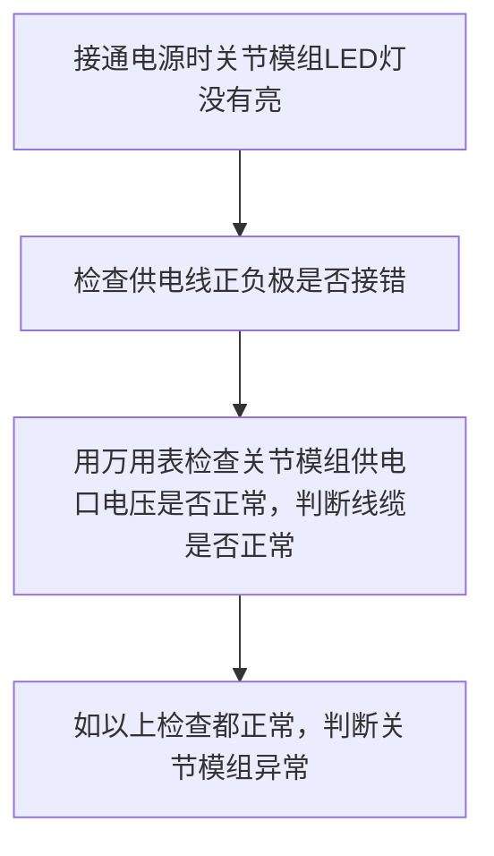
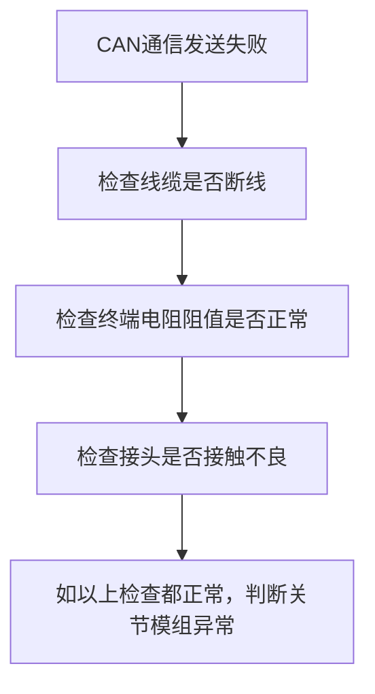
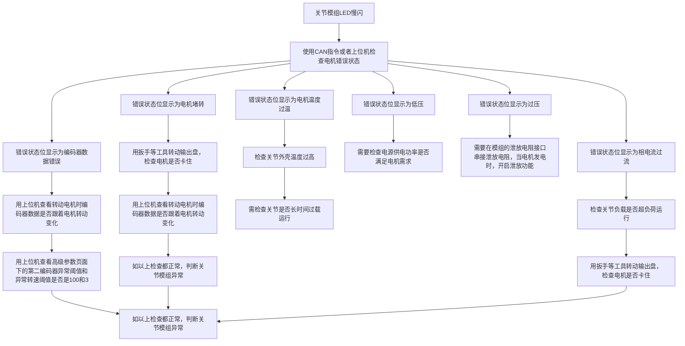

# 电机使用说明
RH 系列关节模组是高度集成一体化的关节模组， 其传动速比大、 承载能力强、 精准控制、 便于携带， 为开发者节省大量时间。  
本手册介绍 RH 系列一体化谐波模组使用参数、 使用方法、 注意事项等信息，请相关使用人员、 调试人员及维修人员务必仔细阅读后再上手操作。

## 📑 目录
***
- [使用注意事项](#使用注意事项)
    - [开箱](#开箱)
    - [测试使用](#测试使用)
    - [存储](#存储)
- [售后政策](#售后政策)
- [接口说明](#接口说明)
- [上位机](#上位机)
- [CAN指令说明](#CAN指令说明)
    - [参数](#参数)
    - [报文格式](#报文格式)
    - [示例](#示例)
- [常见故障排查和处理方法](#常见故障排查和处理方法)

* * *

# 使用注意事项

## 开箱

1.请按照层次顺序拆箱， 严禁猛烈敲击拆箱。  
2.请对照清单检查模组名称是否正确、 附件是否齐全， 设备及其附件表面是否有损伤等情况， 如有问题请勿安装， 及时联系本司。

## 测试使用

1.请勿带电插拔电源线和通信线等，确保电源指示灯熄灭后， 再进行设备的接线和维护。  
2.严禁在通电状态下拆卸设备的任何装置或者附件， 否则有触电危险。  
3.模组外壳不接地可能会导致外壳电荷积累带电， 影响电机的正常运行， 甚至对人体造成伤害； 接线线缆必须符合相应线径和屏蔽要求， 屏蔽线缆的屏蔽层需要可靠接地。  
4.使用前请进行风险评估， 采取适当的措施确保人身安全与设备安全。  
5.请参照手册中各型号的参数使用， 防止损坏模组。  
6.设置恰当的位置限制、 速度限制、 电流限制等， 超出限制可能会损坏电机甚至威胁人身安全。  
7.为预防意外事故的发生， 请对模组进行空载试运行。  
8.模组为精密器件， 请勿使用锤子等用力敲击模组， 请小心放置， 防止出现模组从台面掉落导致裂纹等受损情况。  
9.模组运行过程中， 表面可能会非常烫， 请注意防护。 表面温度超过 40℃ 时请避免长时间接触引起低温烫伤， 当表面温度超过 85℃时更要避免触碰造成轻度烧伤。

## 存储

1.请参照手册严格要求运输及存储温度、 湿度， 并且避免阳光直射、 强磁场、 强电场、 强振动等场所。  
2.避免模组存放时间超过 3 个月， 若存放时间过长请采取更加严密的防护措施和必要的检查维护。  
3.请将模组进行严格包装后再进行运输， 严禁将其与可能会对其造成影响的设备混装运输。

# 售后政策

本产品依据《中华人民共和国消费者权益保护法》 、 《中华人民共和国产品质量法》 严格实行以下售后服务：

- 凡购买本产品的用户， 7 天之内出现产品质量问题， 可享受退换服务。 退换时， 应提供有效购买凭证、 退回发票， 并保证退回的功能完好、 外观无损坏、 配件齐全。
- 凡购买本产品的用户， 自签收次日起一年内享受免费保修服务， 如发生人为损坏、 人为拆机等情况， 不予提供保修服务； 若经检测后， 确认电机需要更换配件， 则需商家和客户协商是否额外购买维修配件。
- 自签收次日起， 7 到 15 天内， 产品出现质量问题， 经确认后， 可享受换货服务。 换货时， 应提供有效购买凭证、 退回发票， 并保证退回的功能完好、 外观无损坏、 配件齐全。
- 发现以下情况不属于保修范围

```
 1.未按用户手册要求安装连接其它控制设备导致电机烧毁。
 2.使用时超出用户手册所示规格或标准（如电机参数设置错误）。
 3.存放方式、 工作环境超出用户手册的指定范围（如污染、 盐害、 结露等。
 4.非正常工况（如跌落、 撞击、 液体侵入、 剧烈撞击等） 造成产品损坏。
 5.不可抗力因素（天灾、 火灾、 水灾等） 造成的产品损坏。
 6.用户自行拆解产品对电机造成损坏损毁。
 7.超出售后政策所提供的保修期限。
 8.无法提供有效购买凭证。
```

在关节模组发生故障情况下， 需第一时间与销售取得联系， 获取解决办法， 用户不得以任何理由进行关节模组拆装维护， 否则将终止保修服务。

# 接口说明

以脉塔RH-20-100电机接口为例。


| 序号  | 接口定义 | 接口说明 |
| :---: | :--- | :--- |
| 1   | DC- | 电源负极 |
| 2   | DC+ | 电源正极 |
| 3   | CAN_L | CAN网络信号 |
| 4   | CAN_H | CAN网络信号 |
| 5   | EtherCAT_IN | EtherCAT输入端 |
| 6   | EtherCAT_OUT | EtherCAT输出端 |
| 7   | BAT- | 多圈编码器电池输入负极 |
| 8   | BAT+ | 多圈编码器电池输入正极 |
| 9   | RES- | 泄放电阻负极接口 |
| 10  | RES+ | 泄放电阻正极接口 |

注： RH-14 型号模组无泄放电阻接口， 使用时请注意以下几点：

- 若与其他型号模组配合使用， 在其他模组已添加泄放电阻时不需要额外添加。
- 若单独使用时需自行添加泄放电阻。
- 其中 EtherCAT 接口定义见电机标签。

# 上位机
如需了解上位机的全部功能请参考此文档：

[上位机使用说明书--V3驱动.pdf](/docs/电机说明/_resources/上位机使用说明书--V3驱动.pdf)

如需下载上位机软件点击面链接：
https://cloud-1251007531.bcdn8.com/maita0712/uploads/20251120/MYACTUATOR_%E8%B0%83%E8%AF%95%E8%BD%AF%E4%BB%B6_V4.0_20250704.zip


# CAN指令说明

## 参数

- 总线接口： CAN
- 波特率：1Mbps

## 报文格式

- 标识符：单电机指令发送： 0x140 + ID(1~32)
- 帧格式：数据帧
- 帧类型：标准帧
- DLC： 8 字节

如需了解电机CAN指令的全部功能请参考此文档：

[伺服电机控制协议V4.3--中文版.pdf](../_resources/伺服电机控制协议V4.3--中文版.pdf)

## 示例
**1.读取PID参数命令示例**：可以读取电流环、速度环和位置环的 PID 参数，数据类型为 Float，通过索引值来确定。

发送指令：
| ID | Data[0] | Data[1] | Data[2] | Data[3] | Data[4] | Data[5] | Data[6] | Data[7] |
| :---: | :---: | :---: | :---: | :---: | :---: | :---: | :---: | :---: |
| 0x141 | 0x30 | 0x01 | 0x00 | 0x00 | 0x00 | 0x00 | 0x00 | 0x00 |

发送指令说明：
- Data[1] = 0x01，按照索引值表格，代表电流环 KP。
  
| 索引值 | 参数名称 |
| :---: | :---: |
|0x01| 电流环 Kp|
|0x02| 电流环 Ki|
|0x04| 速度环 Kp|
|0x05| 速度环 Ki|
|0x07| 位置环 Kp|
|0x08| 位置环 Ki|
|0x09| 位置环 Kd|

回复指令：

| ID | Data[0] | Data[1] | Data[2] | Data[3] | Data[4] | Data[5] | Data[6] | Data[7] |
| :---: | :---: | :---: | :---: | :---: | :---: | :---: | :---: | :---: |
| 0x241| 0x30 | 0x01 | 0x00 | 0x00 | 0x00 | 0x00 | 0x80 | 0x3F |

回复指令说明： 
- Data[1] = 0x01，按照索引值表格，代表电流环 KP 。
- Data[4]为最低位， Data[7]为最高位，组成一个 32 位数据为 0x3F 80 00 00，数据类型为 Float，转换为十进制小数为 1.0，代表电机当前电流环 KP参数为 1.0。

**2.写PID参数命令示例**：写入电流环、速度环和位置环的 PID 参数到 ROM 中，掉电后可以保存，数据类型为 Float，通过索引值来确定。
**注意：避免在电机刚启动以及运动时写入参数。**

发送指令：
| ID | Data[0] | Data[1] | Data[2] | Data[3] | Data[4] | Data[5] | Data[6] | Data[7] |
| :---: | :---: | :---: | :---: | :---: | :---: | :---: | :---: | :---: |
| 0x141 | 0x32 | 0x01 | 0x00 | 0x00 | 0x00 | 0x00 | 0xC0 | 0x3F |

发送指令说明：
- Data[1] = 0x01，按照索引值表格，代表电流环 KP。
- Data[4]为最低位， Data[7]为最高位，组成一个 32 位数据为 0x 3F C0 00 00，数据类型为 Float，转换为十进制小数为 1.5。表示将电机的电流环 KP 参数设定为 1.5 写入到电机驱动的 ROM，断电后参数可以保存。
  
| 索引值 | 参数名称 |
| :---: | :---: |
|0x01| 电流环 Kp|
|0x02| 电流环 Ki|
|0x04| 速度环 Kp|
|0x05| 速度环 Ki|
|0x07| 位置环 Kp|
|0x08| 位置环 Ki|
|0x09| 位置环 Kd|

回复指令：

| ID | Data[0] | Data[1] | Data[2] | Data[3] | Data[4] | Data[5] | Data[6] | Data[7] |
| :---: | :---: | :---: | :---: | :---: | :---: | :---: | :---: | :---: |
| 0x241| 0x32 | 0x01 | 0x00 | 0x00 | 0x00 | 0x00 | 0xC0 | 0x3F |

回复指令说明： 
- Data[1] = 0x01，按照索引值表格，代表电流环 KP 。
- Data[4]为最低位， Data[7]为最高位，组成一个 32 位数据为 0x3F 80 00 00，数据类型为 Float，转换为十进制小数为 1.0，代表电机当前电流环 KP参数为 1.0。

**3.读取多圈编码器位置数据命令示例**：读取编码器多圈的位置，代表了电机转动过的编码器多圈值。

发送指令：
| ID | Data[0] | Data[1] | Data[2] | Data[3] | Data[4] | Data[5] | Data[6] | Data[7] |
| :---: | :---: | :---: | :---: | :---: | :---: | :---: | :---: | :---: |
| 0x141 | 0x60 | 0x01 | 0x00 | 0x00 | 0x00 | 0x00 | 0x00 | 0x00 |

回复指令：

| ID | Data[0] | Data[1] | Data[2] | Data[3] | Data[4] | Data[5] | Data[6] | Data[7] |
| :---: | :---: | :---: | :---: | :---: | :---: | :---: | :---: | :---: |
| 0x241| 0x60 | 0x00 | 0x00 | 0x00 | 0x10 | 0x27 | 0x00 | 0x00 |

回复指令说明： 
- Data[4]为最低位， Data[7]为最高位，组成一个 32 位数据为0x00002710，表示十进制为 10000。代表电机当前相对多圈零偏（初始位置）的多圈编码器值为 10000 个脉冲。

**4.写入编码器当前多圈位置到 ROM 作为电机零点命令示例**：电机当前编码器位置作为多圈编码器零偏（初始位置）写入到 ROM，注意避免在电机刚启动以及运动时写入参数。
注意：写入后新的零点位置后需要发送 0x76（系统复位指令）重启系统后才会有效。因为零偏的改变，设置目标位置时应以新的零偏（初始位置）为参考。

发送指令：
| ID | Data[0] | Data[1] | Data[2] | Data[3] | Data[4] | Data[5] | Data[6] | Data[7] |
| :---: | :---: | :---: | :---: | :---: | :---: | :---: | :---: | :---: |
| 0x141 | 0x64 | 0x00 | 0x00 | 0x00 | 0x00 | 0x00 | 0x00 | 0x00 |

回复指令：

| ID | Data[0] | Data[1] | Data[2] | Data[3] | Data[4] | Data[5] | Data[6] | Data[7] |
| :---: | :---: | :---: | :---: | :---: | :---: | :---: | :---: | :---: |
| 0x241| 0x64 | 0x00 | 0x00 | 0x00 | 0x00 | 0x00 | 0x00 | 0x00 |

**5.速度闭环控制命令示例**：发送速度闭环控制命令，电机会安照指令速度旋转。

发送指令：

| ID | Data[0] | Data[1] | Data[2] | Data[3] | Data[4] | Data[5] | Data[6] | Data[7] |
| :---: | :---: | :---: | :---: | :---: | :---: | :---: | :---: | :---: |
| 0x141 | 0xA2 | 0x00 | 0x00 | 0x00 | 0x10 | 0x27 | 0x00 | 0x00 |

发送指令说明：
- Data[4]为最低位， Data[7]为最高位，组成一个 32 位数据为0x00002710，表示十进制为 10000。发送指令按照 0.01dps/LSB 缩小 100 倍，即10000X0.01=100dps。驱动以电机输出轴 100dps 的速度为目标速度运行。

回复指令：

| ID | Data[0] | Data[1] | Data[2] | Data[3] | Data[4] | Data[5] | Data[6] | Data[7] |
| :---: | :---: | :---: | :---: | :---: | :---: | :---: | :---: | :---: |
| 0x241 | 0xA2 | 0x32 | 0x064 | 0x00 | 0xF4 | 0x01 | 0x2D | 0x00 |

回复指令说明： 
- Data[1] = 0x32 十进制为 50，代表此刻电机温度为 50 度。
- Data[2]和 Data[3]43 /85合成数据 0x0064 十进制为 100，按照 100 倍比例缩小即为 (100X0.01)=1A,那么代表当前电机转矩电流为 1A。
-  Data[4]和 Data[5]合成数据 0x01F4 十进制为 500,代表电机输出轴转速为 500dps。电机输出轴转速和电机转速之间存在减速比的关系，如果减速比为 6，那么电机转速比输出轴转速高 6 倍。
-  Data[6]和 Data[7]合成数据 0x002D十进制为 45，代表电机输出轴相对零点位置正向移动 45 度。电机输出轴位置和电机编码器线数和减速比有关，例如电机编码器线数为 16384，减速比为 6，那么电机输出轴的 360 度对应 16384X6 = 98304 个脉冲。

**6.绝对位置闭环控制命令示例**：发送绝对位置闭环控制命令，电机会安照指令转到对应位置。

发送指令：

| ID | Data[0] | Data[1] | Data[2] | Data[3] | Data[4] | Data[5] | Data[6] | Data[7] |
| :---: | :---: | :---: | :---: | :---: | :---: | :---: | :---: | :---: |
| 0x141 | 0xA4 | 0x00 | 0xF4 | 0x01 | 0xA0 | 0x8C | 0x00 | 0x00 |

发送指令说明：
- Data[2]为低位， Data[3]为高位，组成一个16 位数据为 0x01F4，表示十进制 500dps 电机输出轴速度。驱动会以这个速度为最大速度运行位置环。
- Data[4]为最低位， Data[7]为最高位，组成一个 32 位数据为0x00008CA0，表示十进制为 36000。发送指令按照 0.01degree/LSB 缩小 100 倍，即36000X0.01=360°。电机会以输出轴相对零点位置正向移动 360°。

回复指令：

| ID | Data[0] | Data[1] | Data[2] | Data[3] | Data[4] | Data[5] | Data[6] | Data[7] |
| :---: | :---: | :---: | :---: | :---: | :---: | :---: | :---: | :---: |
| 0x241 | 0xA4 | 0x32 | 0x064 | 0x00 | 0xF4 | 0x01 | 0x2D | 0x00 |

回复指令说明： 
- Data[1] = 0x32 十进制为 50，代表此刻电机温度为 50 度。
- Data[2]和 Data[3]43 /85合成数据 0x0064 十进制为 100，按照 100 倍比例缩小即为 (100X0.01)=1A,那么代表当前电机转矩电流为 1A。
-  Data[4]和 Data[5]合成数据 0x01F4 十进制为 500,代表电机输出轴转速为 500dps。电机输出轴转速和电机转速之间存在减速比的关系，如果减速比为 6，那么电机转速比输出轴转速高 6 倍。
-  Data[6]和 Data[7]合成数据 0x002D十进制为 45，代表电机输出轴相对零点位置正向移动 45 度。电机输出轴位置和电机编码器线数和减速比有关，例如电机编码器线数为 16384，减速比为 6，那么电机输出轴的 360 度对应 16384X6 = 98304 个脉冲。

**7.读取电机状态 1 和错误标志命令示例**：读取当前电机的温度、电压和错误状态标志。

发送指令：

| ID | Data[0] | Data[1] | Data[2] | Data[3] | Data[4] | Data[5] | Data[6] | Data[7] |
| :---: | :---: | :---: | :---: | :---: | :---: | :---: | :---: | :---: |
| 0x141 | 0x9A | 0x00 | 0x00 | 0x00 | 0x00 | 0x00 | 0x00 | 0x00 |

回复指令：

| ID | Data[0] | Data[1] | Data[2] | Data[3] | Data[4] | Data[5] | Data[6] | Data[7] |
| :---: | :---: | :---: | :---: | :---: | :---: | :---: | :---: | :---: |
| 0x241 | 0x9A | 0x32 | 0x00 | 0x01 | 0xE5 | 0x01 | 0x04 | 0x00 |

回复指令说明：
- Data[1] = 0x32 转换成十进制为 50，代表此刻电机温度为 50 度。
- Data[3]表示抱闸表示抱闸控制指令状态，1 代表抱闸释放指令，0 代表抱闸锁死指令，所以 0x01 表示当前抱闸释放指令已经执行。
- Data[4]为低位，Data[5]为高位，组成 0x01E5，转换成十进制为 485，按照 0.1V/LSB 的单位缩小 10 倍，485X0.1=48.5V，代表当前电机供电电压为 48.5V。
- Data[6]为低位，Data[7]为高位，组成 0x0004，对照 System_errorState 表中的错误说明，表示低压错误。

| System_errorState 值 | 状态说明 |
| :---: | :---: |
| 0x0002 | 电机堵转 |
| 0x0004 | 低压  |
| 0x0008 | 过压  |
| 0x0010 | 相电流过流 |
| 0x0040 | 功率超限 |
| 0x0080 | 标定参数写入错误 |
| 0x0100 | 超速  |
| 0x0800 | 元器件过温 |
| 0x1000 | 电机温度过温 |
| 0x2000 | 编码器校准错误 |
| 0x4000 | 编码器数据错误 |

# 常见故障排查和处理方法






